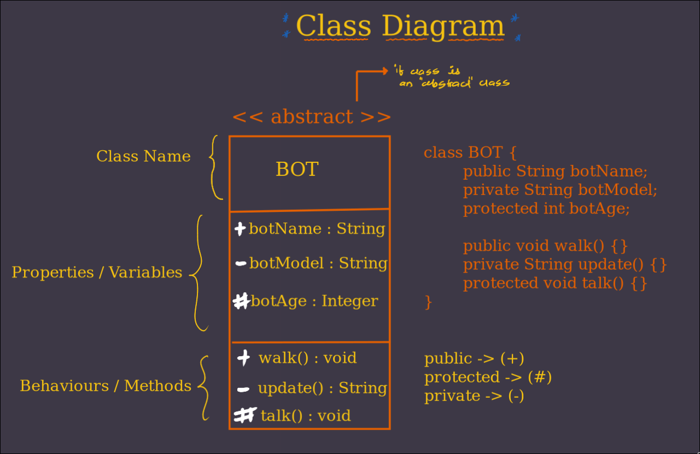
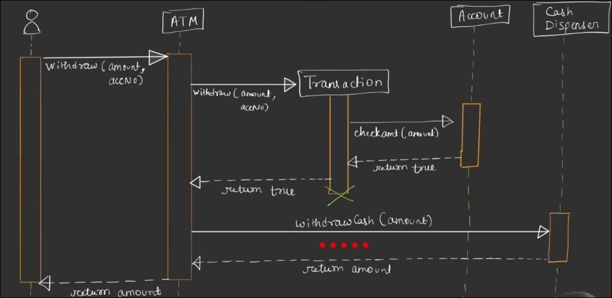
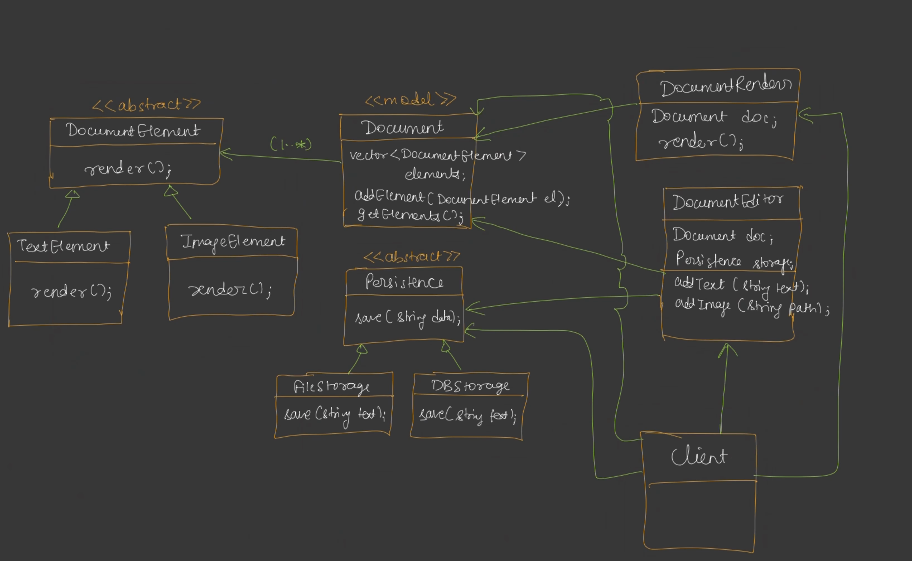
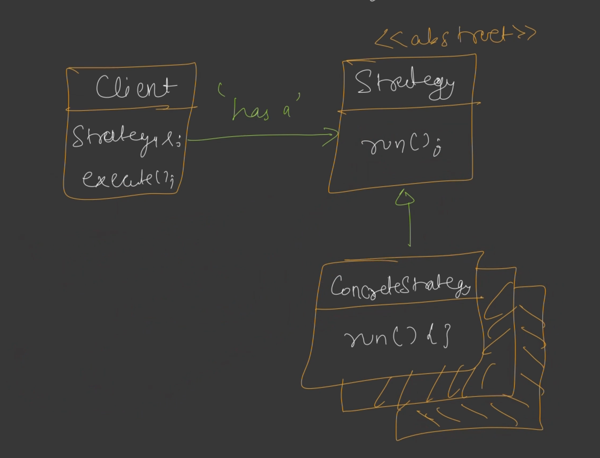

 
    <h1 style = "color:blue"> 📘LLD
</h1>

Low-level design (LLD) is the process of detailing the internal logic, structure, and implementation of individual software components or modules. It translates high-level design (HLD) specifications into detailed, technical blueprints that developers use to write code.

Key aspects of low-level design:

- Specifies class diagrams, methods, data structures, and algorithms.
- Defines interfaces, interactions, and dependencies between modules.
- Includes database schema details, error handling, and security considerations.
- Often documented with sequence diagrams, flowcharts, and pseudo-code.
- Focuses on Scalability, Maintainability, Re-usability.

 
    <h1 style = "color:Green"> 💠 HLD
</h1>

High-level design (HLD) is the process of outlining the overall architecture and structure of a software system. It focuses on how the system will be organized and how its major components will interact.

High-level design focuses on:

- System architecture and main modules/components.
- Relationships and interactions between components.
- Technology stack and external interfaces.
- Data flow and integration points.
- Non-functional requirements (scalability, security, performance).

It provides a blueprint for developers and stakeholders to understand the system’s structure before moving to detailed implementation.

 
    <h1 style = "color:Yellow"> 🏛️ UML Diagrams
</h1>

- UML (Unified Modeling Language) is a standardized way to visualize system architecture and design.
- In LLD, UML diagrams help detail the internal structure and behavior of software components.

 **Common UML Diagrams in LLD:** 

1. **Class Diagram**

    - Shows classes, their attributes, methods, and relationships (inheritance, association, aggregation, composition).
    - Used to model the static structure of the system.

2. **Sequence Diagram**

    - Illustrates object interactions in a time sequence.
    - Useful for visualizing method calls and the flow of messages between objects for a specific scenario.

3. **Activity Diagram**

    - Represents workflows of stepwise activities and actions.
    - Used to model business logic, algorithms, or process flows.

4. **State Diagram**

    - Shows states of an object and transitions between those states.
    - Useful for modeling objects with complex state-dependent behavior.

5. **Component Diagram**
    - Depicts the organization and dependencies among software components.
    - Used to visualize the physical structure of the system.

**Usage in LLD:**

- Class and sequence diagrams are most commonly used.
- Diagrams help clarify design, improve communication, and serve as documentation.

 
    <h1 style = "color : cyan"> 🏛️ Class Diagram
</h1>

<h3 style="color:darkblue; font-family:Arial; ">Example on Class Diagram</h3>

## 🥈Associations

Associations are relationships between two or more classes in a UML diagram.

    ⏭️Class Association : (Inheritance)
    ⏭️Object Association : (simple, Aggregation, Composition)

[Example On Simple, Aggregation, Composition representation](https://www.visual-paradigm.com/guide/uml-unified-modeling-language/uml-aggregation-vs-composition/)

 

 
    <h1 style = "color : pink">  ✴️Sequence Diagram
</h1>

<h3 style="color:darkblue; font-family:Arial; ">User Withdraws money from ATM</h3>

[More on Sequene Diagram](https://www.visual-paradigm.com/guide/uml-unified-modeling-language/what-is-sequence-diagram/)

 

    <h1 style = "color:Orange"> ㊙️Solid Design Principles </h1>

- **S**ingle Responsibility Principle:  
  Each class or function should have only one job or reason to change.

- **O**pen/Closed Principle:  
  Code should be open for extension (you can add new features) but closed for modification (you don’t have to change existing code).

- **L**iskov Substitution Principle:  
  Subclasses should be usable in place of their parent classes without breaking the program.

- **I**nterface Segregation Principle:  
  Don’t force classes to implement interfaces they don’t use; make smaller, more specific interfaces.

- **D**ependency Inversion Principle:  
  Depend on abstractions (like interfaces), not on concrete implementations.

## Problems that can occur, if we don't follow these Principles

- Maintainability
- Readability
- Bugs

 
    <h1 style = "color : pink"> 📃 Design Document Editor 
</h1>

 
    <h1 style = "color : pink">  ✴️ Design Patterns
</h1>

Design patterns are reusable solutions to common problems that occur in software design. They provide a way to solve problems in a standardized and efficient manner.

## Strategy Design Pattern#️⃣

- Define a family of algorithms, encapsulate each one, and make them interchangeable.
  
